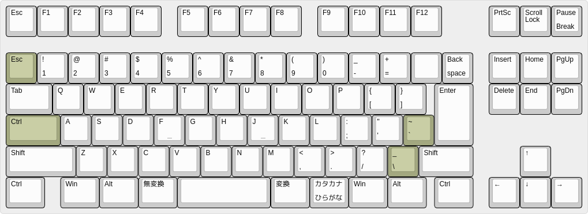

# これは何？

Linux で jp106 キーボードを（キーの多さを活かしつつ）US 配列化するための XKB 定義の差分ファイルです。この設定をインストールするための自動書き換えツールも付随しています（ただし、そのインストールのほうが大変かも…）

[](http://www.keyboard-layout-editor.com/#/gists/8f7f42a8b0842d5dfa7dcb2b808095fd)


* 現状では Fedora Linux でしか試していません。以下の説明もファイルの置き場所などは Fedora Linux の場合です。

## 手動でインストールする場合

1. xkb の symbols ディレクトリ(`/usr/share/X11/xkb/symbols/`) の、日本語キーボード用ファイル `jp` に [symbols/jp_us](symbols/jp_us) を追記してください

2. xkb の rules ディレクトリ(`/usr/share/X11/xkb/rules/`)の、ルール一覧ファイル `evdev.lst` の、 `! variant` セクションに以下の行を加えて下さい(先頭で大丈夫です)
  ```
  jp_us	Japanese (JP106 with US)
  ```
3. 同じく xkb の rules ディレクトリの、ルールの説明ファイル `evdev.xml` の、
xpath で言う `//layout/configItem/name[text() = "jp"]/parent::node()/parent::node()/variantList` に相当する箇所の中に、xml で以下のタグを加えて下さい。
   ```xml
   <variant>
     <configItem>
       <name>jp_us</name>
       <description>JP106 with US layout</description>
     </configItem>
   </variant>
   ```

これでデスクトップにログインし直せば、日本語キーボードの variant として
`JP106 with US layout` が選べる、はずです。

## 自動書き換えを使う場合


* 設定書き換えスクリプトは拙作の [TclTaskRunner.tcl](https://github.com/hkoba/wip-TclTaskRunner0) を利用しています。予め PATH を通しておいてください。
* ↑ Tcl8.6 と tcllib が必要です
* 書き換えスクリプトの中で [xpath コマンド](https://metacpan.org/pod/XML::XPath)を呼びます。これも別途インストールが必要です

## 設定書き換えスクリプト [`main.tcltask`](./main.tcltask) について

インストール

```sh
./main.tcltask
```

dry-run

```sh
./main.tcltask -n
```
